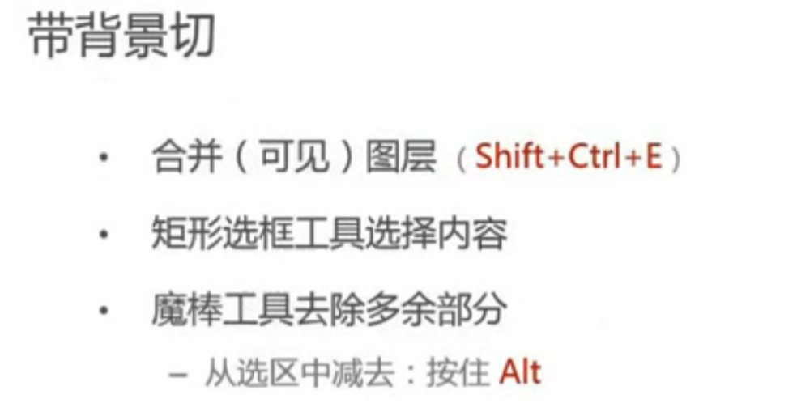

# 切图
* 初始设置  
> * 工具，面板，视图  
* 测量，取色  
* 切图  
* 保存  
* 修改和维护  
* 注意事项  

## 初始设置  
### ps首选项设置  
> 编辑 > 首选项 > 单位与标尺  
  
### 面板  
> 工具  
> 选项  
> 信息  
> 图层  
> 历史纪录  
### 工具  
> 移动工具  
> 矩形选框工具  
> 魔棒工具  
> 裁剪工具+切片工具  
> 缩放工具  
>> 放大： Ctrl + /command +  
>> 缩小：  
> 取色器  

移动工具：选项栏-自动选择，图层（而不是组）  
魔棒工具：容差  
裁剪工具：双击，完成裁剪  

### 辅助视图  
> 视图菜单下开启  
>> 对齐  
>> 标尺 ctrl+R /command+R  
>> 显示 > 参考线 Ctrl + ; / command + ;  

## 测量&取色  
### 测量  
> 信息面板 + 矩形选框工具  

> 文字大小的测量：  
>>   

> 行高的测量：  
>> 1.单图层的情况：  
    定位到文字图层——选中文字工具——点击文字——工具选项面板——切换字体和段落面板按钮——读取行高信息  
      
>> 2.2.文字作为背景图层的情况：  
 矩形选框——第一行文字的下面--第二行文字的下面，即行高。  
 ### 取色  
> 获取文字颜色：  
>>     1.文字作为单独的图层：  
>>     选择文字之后——文字工具——选项面板——颜色按钮——颜色信息  
>>     2.文字作为背景图：  
>>     拾色器工具  
>>     3.虽然是单独图层，但是有叠加效果的文字（也就是实际的显示与肉眼看到的颜色不同的情况）  
>>      此时，不能是文字信息里的颜色为准，而是要用拾色器。  

## 切图  
### 确定需要切出来的内容  
> 需要切的(修饰性的，一般用在background属性)
>> 图标，logo  
>> 有特殊效果的按钮，文字等  
>> 非纯色的背景  

> 不需要切的(内容性的，一般用在img标签)  
>> Banner,广告图片  
>> 文章中的配图  
>> * 不需要切，但是需要占位  
### 确定需要保存的类型：  
> 修饰性的：  
>>  PNG24  
>>  PNG8  
> 内容性的：  
>> 一般为JPG  
### 切图步骤  
> 1.隐藏文字只保留背景  
  
>> 平铺背景覆盖文字的情况：  
     1.背景没有纹理效果：  
          选中图层——矩形选框工具——在背景上选择一个拉伸后可以覆盖文字的矩形选区——Ctrl+T——拉伸覆盖  
     2.背景有纹理效果：  
          选中图层——矩形选框工具——画一个矩形选区——移动工具，同时按住alt键不放——逐渐移动覆盖，期间按住shift键（保证只能水平移动）  

> 2.切图  
>>    png24  
   
>> png8  
      
    因为PNG8格式不支持半透明效果，如果图片有半透明的效果，就需要带背景切图。  
>> 可平铺背景的切图  
      
针对CSS中background-repeat属性  
>> 切片工具  
      
>>保存（全选切片，统一设置存储格式）  
   1.将工具切换到切片选择工具（和切片工具在一个组里）双击要保存的切片部分，设置名称和其他信息。  
   2.导出——储存为web所用格式  

## 保存  
> 1.存为所需的内容  
>> 复制（ctrl+c)、新建(ctrl+N)、粘贴(ctrl+V)  
>> 或者拖动内容到新文件  
>> 储存为web所用格式(Alt+shift+ctrl+s)  

>新建文件  
新建文件：  
命名；  
宽高；  
背景设置为透明  

>对于已经合并在一起的文件，  
需要先矩形选框，然后魔棒工具+alt键；  
再复制，新建，粘贴。  

## 保存格式  
> 保存类型1  
图片色彩丰富且无透明要求  
保存为JPG格式并选择合适的品质  
适当的压缩品质；原则是不要设置成100%
  
>保存类型2  
>当图片色彩不太丰富时无论有无透明要求，  
>保存为PNG8格式  
> * 只有256种颜色
设置注意点：
杂边：无；
无仿色

>保存类型3  
> 当图片有半透明要求；  
> 保存为PNG24格式  
  
> 保存类型4：  
> 为保证图片质量，需要保留一份PSD，在PSD上进行修改  
  

## 修改和维护  
* 更改画布大小  
图像-画布大小-定位（左上角）  
* 移动图标  
  1.独立图层：移动工具拖动即可  
  2.非独立图层：  
        1.选区工具选中区域  
        2.用移动工具拖动图标  

如何将同一图层的图片分成不同的图层？  
1.选中需要分开的图层；  
2，选取工具选择要分开的图片中的一个，Ctrl+X剪切，再Ctrl+V粘贴，就可以分开图层了。   
* 减小画布到指定区域  
选定选区-图像-裁剪  

两种裁剪方法：  
1.选中选区——图像，裁剪  
2.裁剪工具——调整区域——双击   

## 注意事项  
修改png8的图片需要更改颜色模式为：RGB颜色  
在图像-模式-RGB颜色  
PNG8格式的图片默认是索引颜色模式，需要更改为RGB颜色模式  
打开PNG8格式的图片，名称栏的最后会出现它的颜色模式的名称。
## ps 操作技巧  
### 矩形选框工具的快捷键  
  
### 纯色与渐变色的判断  
  
### 提取合并在一起的文件  
>对于已经合并在一起的文件，  
需要先矩形选框，然后魔棒工具+alt键；  
再复制，新建，粘贴。  
### 拆分同一图层为不同图层  
1.选中需要分开的图层；  
2，选取工具选择要分开的图片中的一个，Ctrl+X剪切，再Ctrl+V粘贴，就可以分开图层了。