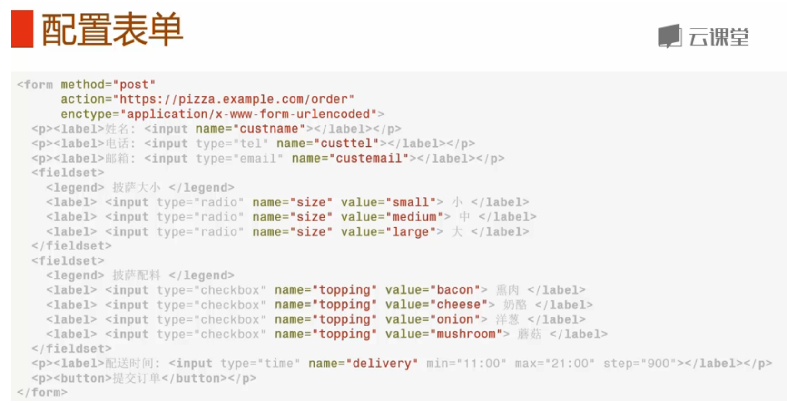
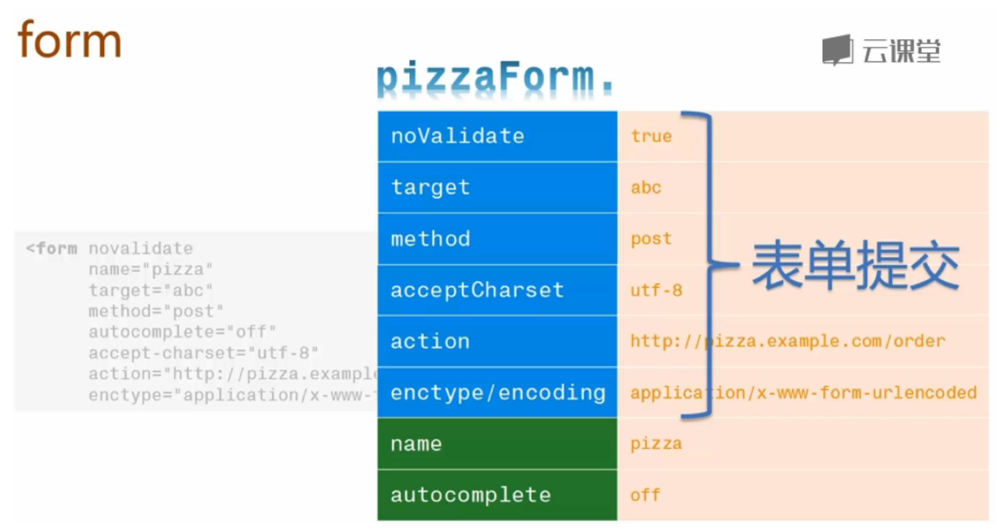
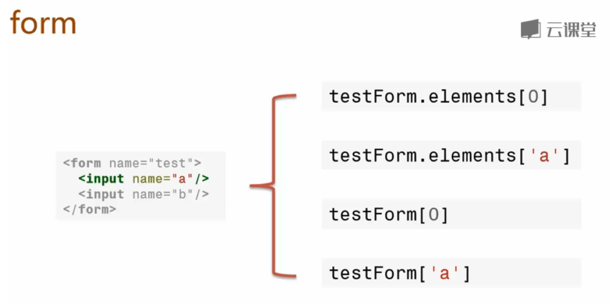
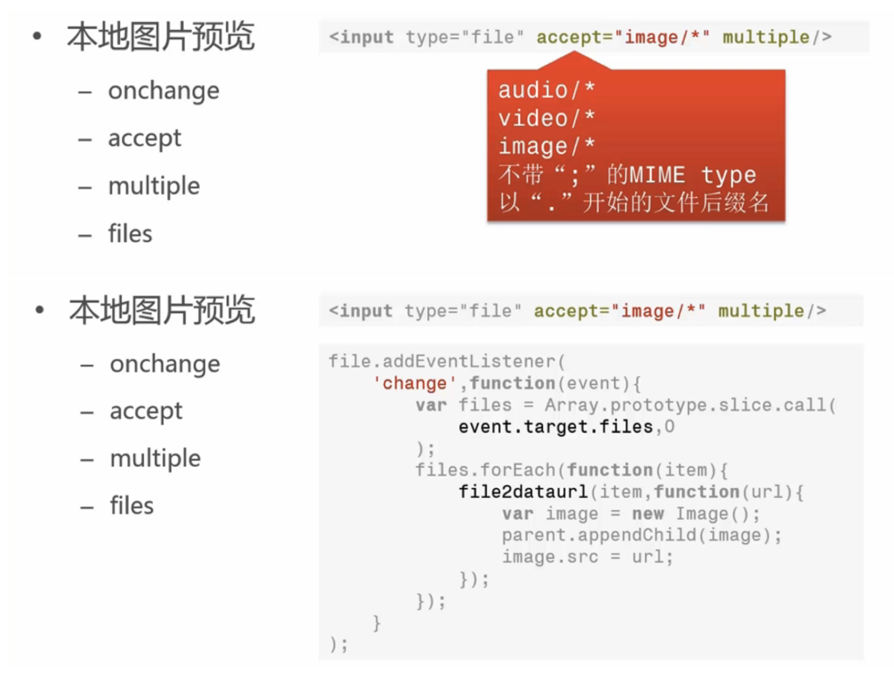
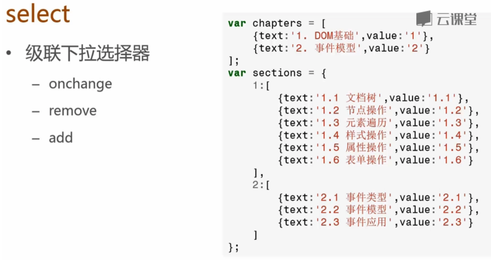
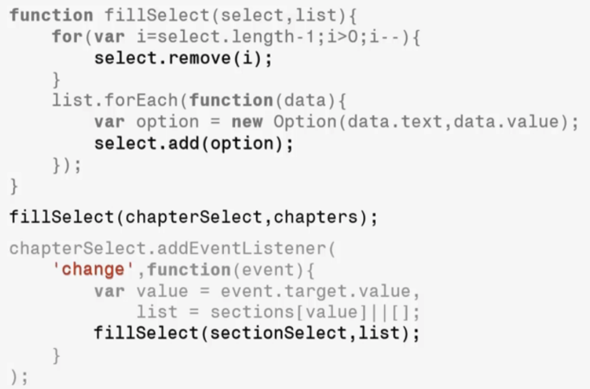
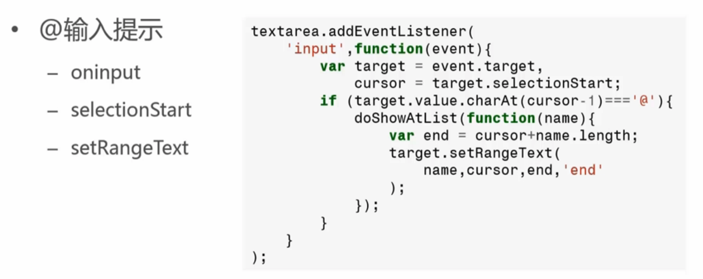
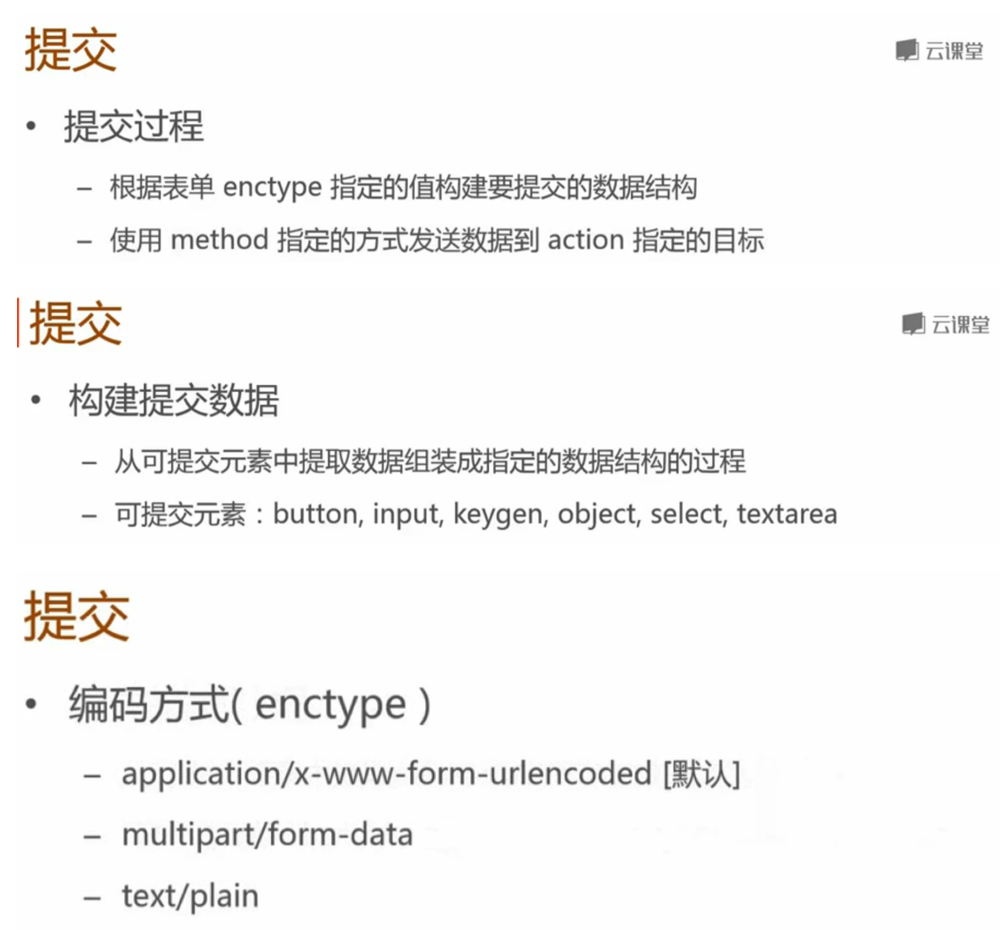

# form
## 配置表单  
  
## 表单验证  
  

获取表单：  
let pizzaForm = document.forms.pizza;  

获取元素： 
  

表单重置：  
fileForm.reset()  

本地图片预览  
  

select级联下拉选择器  
  
  

textarea@输入提示功能  
  

表单提交  
  

利用iframe实现表单的无刷新提交  
```html  
1. <iframe name="formsubmit" id="myFrame" style="display: none"></iframe>   
2. <!-- 将form表单提交的窗口指向隐藏的ifrmae,并通过ifrmae提交数据。 -->   
3. <form action="./login" method="POST" name="forphp" id="myForm"target="formsubmit">   
4.     <p><label for="uname">用户名：<input type="text" name="uname" id="uname"/> </label> </p>   
5.     <p><label for="pwd">密 码： <input type="password" name="pwd" id="pwd"/></label></p>    
6.     <p><input type="submit" value="登录" id="sub"/></p>   
7. </form>
8. <script type="text/javascript">
9.     var form  = document.getElementById('myForm');
10.     var frame = document.getElementById('myFrame');
11.     // 绑定onload事件
12.     addEvent(frame, 'load', function(event){ 
13.             try{
14.                 var result = JSON.parse(frame.contentWindow.document.body.textContent);
15.                 // 识别登录结果
16.                 if (result.code === 200){
17.                     callback(result.result.uname,result.result.psw);       
18.                 }
19.             }catch(er){
20.                 //捕获错误
21.             }
22.         }
23.     );
24.     //兼容IE注册事件
25.     function addEvent(node, type, handler){
26.            if (node.addEventListener){
27.                node.addEventListener(type, handler, false);
28.            }else if(node.attachEvent){
29.                node.attachEvent('on' + type, handler);
30.            }else{
31.                node['on' + type] = handler;
32.            }}
33.  
34.     function callback(a,b){
35.         var uname = document.getElementById('uname').value;
36.         var pwd = document.getElementById('pwd').value;
37.         if(uname == a && pwd == b ){
38.             alert('登录成功');
39.             form.reset();
40.         }
41.         else{
42.             alert('账号密码错误');
43.         }
44.     }
45. </script>
46. // ./login文件内容
47. // {
48. //     "code": 200,
49. //     "result":{
50. //         "uname":"admin",
51. //         "psw":"test"
52. //     }
```

操作文件
在HTML表单中，可以上传文件的唯一控件就是<input type="file">。
注意：当一个表单包含<input type="file">时，表单的enctype必须指定为multipart/form-data，method必须指定为post，浏览器才能正确编码并以multipart/form-data格式发送表单的数据。
出于安全考虑，浏览器只允许用户点击<input type="file">来选择本地文件，用JavaScript对<input type="file">的value赋值是没有任何效果的。当用户选择了上传某个文件后，JavaScript也无法获得该文件的真实路径：
通常，上传的文件都由后台服务器处理，JavaScript可以在提交表单时对文件扩展名做检查，以便防止用户上传无效格式的文件：
var f = document.getElementById('test-file-upload');
var filename = f.value; // 'C:\fakepath\test.png'if (!filename || !(filename.endsWith('.jpg') || filename.endsWith('.png') || filename.endsWith('.gif'))) {
    alert('Can only upload image file.');
    return false;
}


File API

由于JavaScript对用户上传的文件操作非常有限，尤其是无法读取文件内容，使得很多需要操作文件的网页不得不用Flash这样的第三方插件来实现。
随着HTML5的普及，新增的File API允许JavaScript读取文件内容，获得更多的文件信息。
HTML5的File API提供了File和FileReader两个主要对象，可以获得文件信息并读取文件。
下面的例子演示了如何读取用户选取的图片文件，并在一个<div>中预览图像：
``` javascript
var
    fileInput = document.getElementById('test-image-file'),
    info = document.getElementById('test-file-info'),
    preview = document.getElementById('test-image-preview');
// 监听change事件:
fileInput.addEventListener('change', function () {
    // 清除背景图片:
    preview.style.backgroundImage = '';
    // 检查文件是否选择:
    if (!fileInput.value) {
        info.innerHTML = '没有选择文件';
        return;
    }
    // 获取File引用:
    var file = fileInput.files[0];
    // 获取File信息:
    info.innerHTML = '文件: ' + file.name + '<br/>' +
                     '大小: ' + file.size + '<br/>' +
                     '修改: ' + file.lastModifiedDate;
    if (file.type !== 'image/jpeg' && file.type !== 'image/png' && file.type !== 'image/gif') {
        alert('不是有效的图片文件!');
        return;
    }
    // 读取文件:
    var reader = new FileReader();
    reader.onload = function(e) {
        var
            data = e.target.result; // 'data:image/jpeg;base64,/9j/4AAQSk...(base64编码)...'           
        preview.style.backgroundImage = 'url(' + data + ')';
    };
    // 以DataURL的形式读取文件:
    reader.readAsDataURL(file);
});
```  
上面的代码演示了如何通过HTML5的File API读取文件内容。以DataURL的形式读取到的文件是一个字符串，类似于data:image/jpeg;base64,/9j/4AAQSk...(base64编码)...，常用于设置图像。如果需要服务器端处理，把字符串base64,后面的字符发送给服务器并用Base64解码就可以得到原始文件的二进制内容。  

//readAsDataURL

HTML
<input type="file" onchange="previewFile()"><br>


JavaScript
``` javascript
function previewFile() {
  var preview = document.querySelector('img');
  var file    = document.querySelector('input[type=file]').files[0];
  var reader  = new FileReader();

  reader.addEventListener("load", function () {
    preview.src = reader.result;
  }, false);

  if (file) {
    reader.readAsDataURL(file);
  }
}
```  

